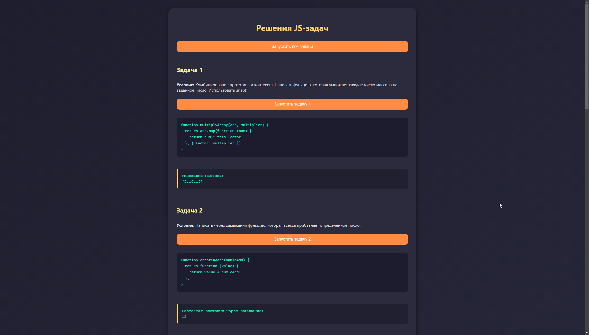
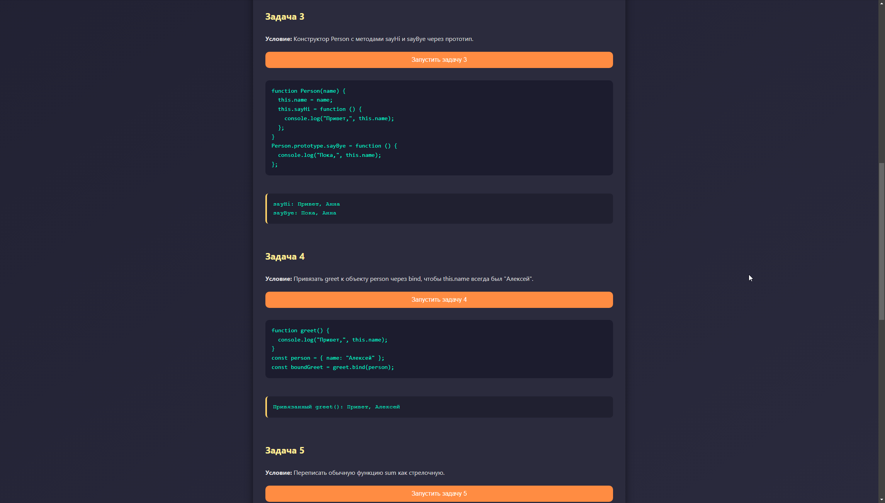
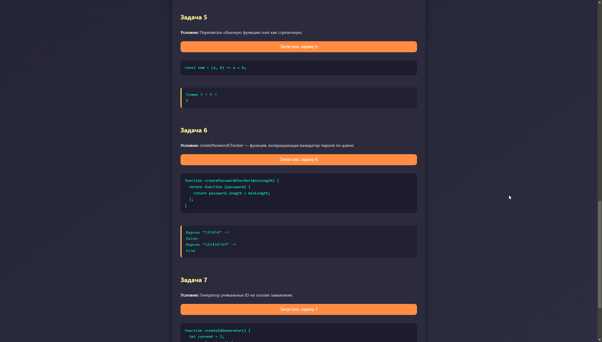
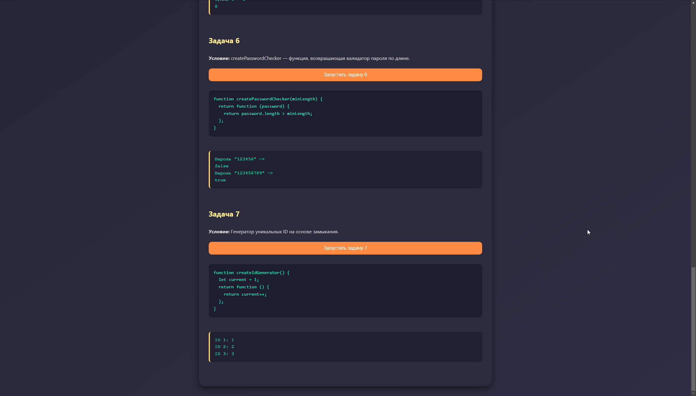
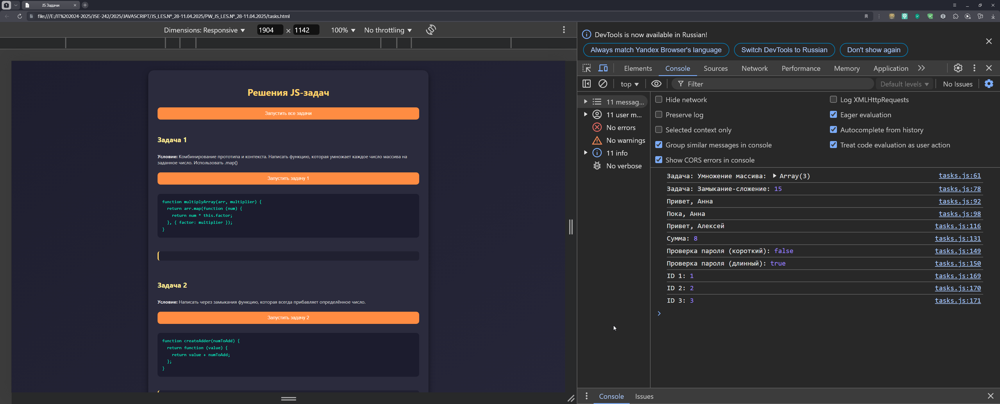
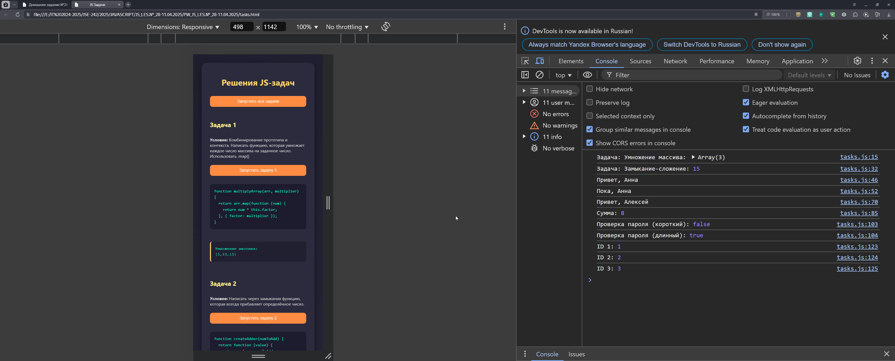
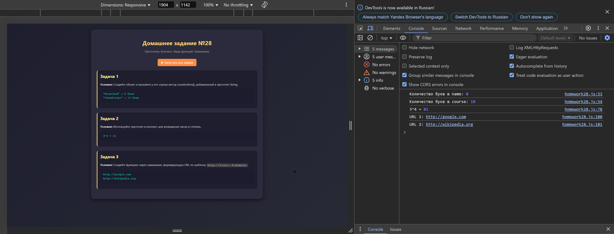
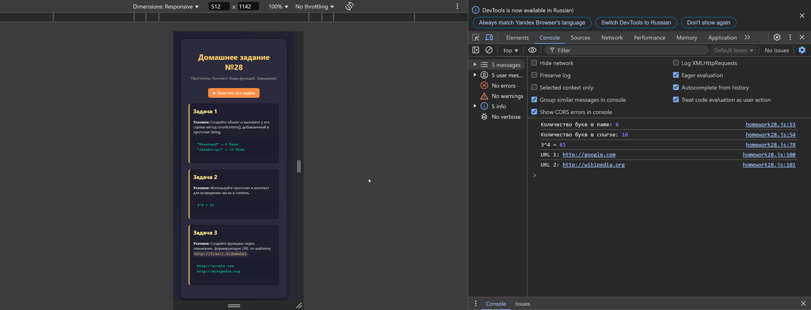

# 💼 Практическая и Домашняя работа №28

**Курс:** Разработка интерфейса на JavaScript  
**Дисциплина:** Основы JavaScript  
**Тема:** Прототипы. Контекст. Виды функций. Замыкания  
**Дата выполнения:** 11.04.2025

---

## 🗂️ Структура проекта

```
JS_LES.№_28-11.04.2025
├── HW_JS_LES.№_28-11.04.2025       # Домашняя работа
│   ├── Домашка.png
│   ├── Домашка+Консоль.png
│   ├── Домашка+консоль+Мобилка.png
│   ├── homework28.html
│   ├── homework28.css
│   └── homework28.js
│
├── PW_JS_LES.№_28-11.04.2025       # Практическая работа
│   ├── Практика1-2.png
│   ├── Практика3-4.png
│   ├── Практика5-6.png
│   ├── Практика6-7.png
│   ├── Практика+Консоль.png
│   ├── Практика+консоль+Мобилка.png
│   ├── tasks.html
│   ├── tasks.css
│   └── tasks.js
│
└── README.md
```

---

## 📘 Практическая работа (`PW_JS_LES.№_28-11.04.2025`)

### ✅ Задача 1: Комбинирование прототипа и контекста
```js
function multiplyArray(arr, multiplier) {
  return arr.map(function (num) {
    return num * this.factor;
  }, { factor: multiplier });
}
```
> Умножение элементов массива через map и контекст

### ✅ Задача 2: Замыкание с добавлением
```js
function createAdder(numToAdd) {
  return function (value) {
    return value + numToAdd;
  }
}
```

### ✅ Задача 3: Прототип + конструктор
```js
function Person(name) {
  this.name = name;
  this.sayHi = function () {
    console.log("Привет,", this.name);
  }
}
Person.prototype.sayBye = function () {
  console.log("Пока,", this.name);
}
```

### ✅ Задача 4: Контекст `this` и `bind`
```js
function greet() {
  console.log("Привет,", this.name);
}
const person = { name: "Алексей" };
const boundGreet = greet.bind(person);
```

### ✅ Задача 5: Стрелочная функция
```js
const sum = (a, b) => a + b;
```

### ✅ Задача 6: Валидатор пароля
```js
function createPasswordChecker(minLength) {
  return function (password) {
    return password.length > minLength;
  }
}
```

### ✅ Задача 7: Генератор ID
```js
function createIdGenerator() {
  let current = 1;
  return function () {
    return current++;
  }
}
```

### 📸 Визуализация:







---

## 🏠 Домашняя работа (`HW_JS_LES.№_28-11.04.2025`)

### ✅ Задача 1: Метод `countLetters()` в прототипе строки
```js
String.prototype.countLetters = function () {
  return this.length;
};
```

### ✅ Задача 2: Возведение в степень через контекст и прототип
```js
function Power(base) {
  this.base = base;
}
Power.prototype.toPow = function (exp) {
  return Math.pow(this.base, exp);
}
```

### ✅ Задача 3: Формирование URL через замыкание
```js
function createURL(domain) {
  return function (url) {
    return `http://${url}.${domain}`;
  }
}
```

### 📸 Визуализация:




---

## 💬 Комментарии

- 📁 Файлы разделены по смыслу: практическая и домашняя работа
- 🧪 Все задачи протестированы и работают в браузере (десктоп/мобилка)
- 🛠️ Использован чистый JS без библиотек, только HTML/CSS/JS
- ✅ Все действия выводятся в консоль разработчика (DevTools)

---

> Сделано с вниманием к деталям, аккуратностью и знанием основ JavaScript. Готово к проверке, защите или просто как образец для вдохновения.
